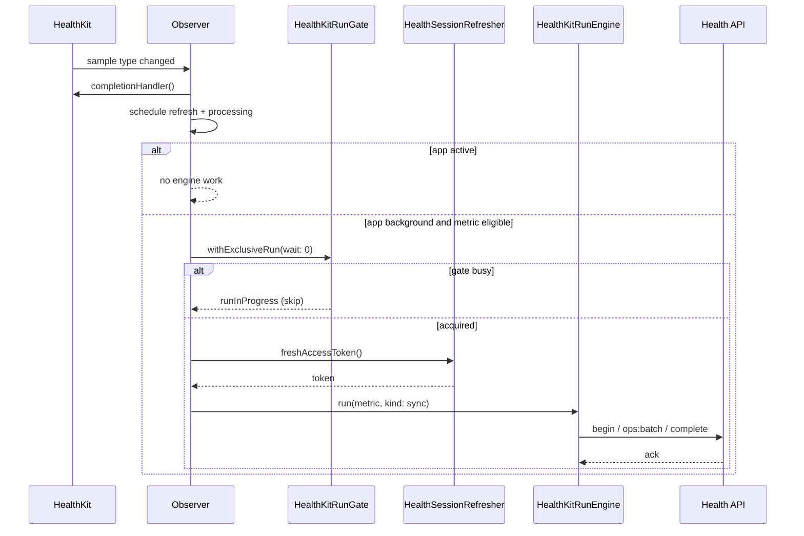

# HealthKit Background Sync Reliability Plan

| Field | Value |
| --- | --- |
| Status | Draft |
| Date | 2026-08-16 |
| Branch / worktree | `docs/healthkit-background-sync-plan` at `/Users/deepanshu/Desktop/projects/family-os-bg-sync` |
| Supersedes for this slice | Phase 5 notes in `docs/HEALTHKIT_SYNC_AND_MCP_PRODUCT_PLAN.md` §9 (those gaps are already implemented) |
| Still governs | `docs/HEALTHKIT_CORRECTNESS_FIRST_SYNC_PLAN.md` (no MainActor BG handlers, no hidden import, no deletes on routine sync) |
| Does not authorize | Heart-rate upload, steps observer expansion before soak, or new HealthKit groups |

## Overview

Background HealthKit sync already exists. The remaining work is reliability, not a second pipeline.

Today the app registers a nonisolated `BGProcessingTask`, rebuilds HealthKit observers from the local enabled set, and runs the same `HealthKitRunEngine` incremental `sync` as the foreground Sync button. That is the right shape. It is not yet dependable: expired access tokens fail the wake, observers only schedule a later processing task that iOS may delay for hours, heart rate wakes the process even though vitals upload is blood pressure only, and become-active only drains the outbox.

This plan sequences small, independently shippable PRs that make already-imported blood pressure, sleep, and workouts stay current without reintroducing the MainActor isolation crash or the observer-vs-Import run-gate race. After those wakes work, a lock-screen local notification reports a finished non-empty background sync (metric + how many uploaded). No “running…” notification.

## Background and current state

### What already works

```text
HealthKit sample change
  → HKObserverQuery (ack immediately)
  → schedule BGProcessingTask
  → (later, if iOS runs it)
       HealthKitBackgroundSync.runBoundedSync
         → HealthKitRunGate (wait 0)
         → for each eligible metric: kind = sync
              begin → fetch/enqueue → drain /ops:batch → complete
```

| Piece | Location | Behavior |
| --- | --- | --- |
| Registration | `FamilyOSApp.swift` `NotificationAppDelegate` | Nonisolated `registerBackgroundTask()` at launch |
| Task id | `Info.plist` + `HealthKitBackgroundSync.taskIdentifier` | `com.deepanshujain.familyos.healthkit-sync` |
| Modes / entitlements | `Info.plist`, `FamilyOS.entitlements` | `processing` + unused `fetch`; HealthKit background delivery |
| Allowlist | `backgroundMetrics` | `.vitals`, `.sleep`, `.workouts` — **not** activity |
| Eligibility | `incrementalEligibility` | Enabled ∩ allowlist ∩ import already complete |
| Shared engine | `HealthKitRunEngine` | Server range = `lastSuccessfulAt − 24h` → now, `allowDeletes: false` |
| Gate | `HealthKitRunGate` | FG waits 45s; BG waits 0 and skips |
| Save / launch reconcile | `HealthBootstrapHealthKitViewModel`, `reconcileFromLocalStore` | Disabled metrics lose observers and delivery |
| Become-active | `FamilyOSApp.onChange(scenePhase)` | Schedule task + `drainIfConfigured()` only |

### Why it still goes stale

1. **Token.** Foreground HealthKit commands call `refreshSessionIfNeeded()` on `HealthBootstrapViewModel` (`@MainActor`). Background reads the Keychain access token as-is. A JWT past `exp` (or within 60s) is sent to the API, gets 401, and the wake is wasted. `dev-token` is correctly not treated as a JWT.
2. **Observer wake is unused.** `c2fcb33` stopped observers from calling `runBoundedSync` because that held the process-wide gate, raced user Import/Sync, and left server group status on `syncing` / Interrupted. The fix was correct and too complete: the only remaining path is `BGProcessingTask`, which Apple treats as deferrable.
3. **`fetch` is declared and unused.** There is no `BGAppRefreshTask`.
4. **Become-active does not read HealthKit.** Opening the app uploads leftover ops but does not pull new samples until the user taps Sync or a processing task eventually runs.
5. **Heart-rate observer is a false wake.** `backgroundTypes` enables `HKQuantityType.heartRate` for vitals, but `makeFetchAndEnqueue` only calls `HealthKitBloodPressureSync`.
6. **401 retry is missing.** Correctness plan §7.5 requires single-flight refresh + one retry. The worker backs off and rethrows.
7. **Foreground refresh failure signs the user out.** That must not be copied into background: a transient refresh failure on a locked phone must not wipe Keychain.

### What this plan will not change

- First import and repair stay user-initiated and foreground.
- Routine sync still never deletes.
- Activity / steps stay foreground-only until a device soak of the existing steps path says otherwise (`docs/HEALTHKIT_STEPS_AND_HEART_RATE_PLAN.md`).
- Daily heart-rate upload stays a later vitals slice, not this program.
- First import is still a one-time tap. After that, Sync is automatic (observer / refresh / processing / become-active).

## Goals and non-goals

### Goals

1. A background or observer wake with a valid refresh token can obtain a fresh access token without hopping to a `@MainActor` view model.
2. A 401 on `begin` / `ops:batch` / `complete` during background work refreshes once and retries once.
3. An observer delivery can do a **short, gated, single-metric** incremental sync in the Apple-provided wake, without blocking a user Import/Sync that is already running, and without starting work if the user is in the HealthKit UI.
4. Become-active performs the same incremental sync for already-imported background metrics, still through the shared gate.
5. `BGAppRefreshTask` exists as a cheap periodic nudge, or the unused `fetch` mode is removed. This plan adds the refresh task (see Key Decisions).
6. Heart rate does not enable background delivery until heart-rate upload exists.
7. Crashlytics and unit tests cover the new policy seams. A physical-device soak is the release gate.
8. With alerts on, a locked-phone background sync that uploaded at least one record posts one local notification: metric name + count. No start/progress notification.

### Non-goals

- A second upload path, local cursor, or coordinator type.
- Background initial import or repair.
- Preempting an in-flight user run (cancel-and-takeover).
- Remote/APNs push, push-to-sync, or server-initiated wakes. Alerts are **local** (`UNUserNotificationCenter`) from the already-awake device.
- A “running sync of X” lock-screen notification.
- Alerts when the app is already foreground (become-active / button). The in-app banner covers that.
- Expanding MCP or adding heart-rate / steps background upload in the reliability PRs.
- Promising a sync interval in UI copy.

## Key decisions

1. **One engine, three nudges.** Observer wake, `BGAppRefreshTask`, and `BGProcessingTask` only call `runBoundedSync` / `drainIfConfigured`. No parallel fetch or POST path.
2. **Extract a nonisolated session refresher; do not refresh from the view model in BG.** `HealthBootstrapViewModel.refreshSessionIfNeeded()` stays the foreground wrapper. Background uses a new `HealthSessionRefresher` that reads/writes Keychain + the existing `DefaultsKey` values. It is `@unchecked Sendable` or an actor, never `@MainActor`.
3. **Background refresh failure is fail-soft.** Do not call `HealthAuthViewModel.clear`. Log `healthkit_bg_token_refresh_failed` and skip the wake. Only the user-visible sign-in flow may clear the session.
4. **Observer work is single-metric and time-boxed.** Map the fired `HKSampleType` to at most one `HealthKitSyncMetric`. Ack first, then `Task` with `waitSeconds: 0` and a ~25s wall timeout. If the gate is held or time expires, schedule processing and return. Never run a multi-metric loop from an observer.
5. **Foreground scene does not start observer sync.** If `UIApplication.shared.applicationState == .active`, observers only schedule. Become-active owns the in-app incremental pass so a user tap is not racing an observer loop.
6. **Keep `BGProcessingTask` for the long drain.** Refresh tasks are the periodic nudge. Processing tasks remain `requiresNetworkConnectivity = true` and do the full eligible-metric loop.
7. **Remove the heart-rate observer now.** It is not a product feature; it is extra wakes. Re-add it in the heart-rate PR.
8. **Do not put steps in `backgroundMetrics` in this program.** A later PR after soak. The eligibility helper already skips activity.
9. **No new coordinator.** If `HealthKitBackgroundSync` grows, extract only `HealthSessionRefresher` and a small `HealthKitObserverWakePolicy` value type for tests.
10. **Completion-only local alerts, off until the user turns them on.** Wire the existing `backgroundSyncAlertsEnabled` stub. Notify only after a successful background `kind: .sync` with `appliedCount > 0` (or `fetchedCount > 0` if that is the only honest number), one notification per finished metric. Never notify for skip, timeout, 401, empty range, or `runInProgress`. Persist the toggle in `UserDefaults` (not SQLite). Request notification permission when the user enables the toggle, not at launch.

## Proposed design

### 1. Session refresh for nonisolated callers

New file: `apps/ios/FamilyOS/Services/HealthSessionRefresher.swift`.

```swift
struct HealthSessionTokens: Sendable {
    var accessToken: String
    var refreshToken: String?
}

enum HealthSessionRefresher: Sendable {
    /// Returns a usable access token, or nil if BG should skip.
    static func freshAccessToken() async -> String?
}
```

Algorithm (mirrors `refreshSessionIfNeeded`, minus sign-out):

1. Read access token from `KeychainStore` (`DefaultsKey.accessToken`).
2. If empty → `nil`, log `healthkit_bg_sync_skip_no_token`.
3. If `!AccessTokenExpiry.requiresRefresh(token)` → return it. This keeps `dev-token` working.
4. Read refresh token. If missing → `nil`, log `healthkit_bg_sync_skip_no_refresh_token`. Do not clear Keychain.
5. Single-flight via a small actor (`HealthSessionRefreshGate`) so observer + processing + become-active cannot stampede Supabase.
6. `SupabaseAuthClient.refreshSession` using `UserDefaults` `DefaultsKey.supabaseURL` / `supabaseAnonKey`, falling back to `AppEnvironment.current`.
7. On success, write both tokens to Keychain. Do **not** touch `@Published` auth state. The next foreground `HealthAuthViewModel` init or an explicit reload will pick them up.
8. On failure, leave Keychain as-is, log non-fatal, return `nil`.

Foreground change: `refreshSessionIfNeeded()` should call the same refresher, then copy the new tokens into `HealthAuthViewModel` on the main actor. That keeps one refresh implementation.

Do **not** store tokens in the HealthKit SQLite database.

### 2. One 401 retry on HealthKit API writes

Add a helper used by the background (and, if cheap, foreground) `postBatch` / `beginRun` / `completeRun` closures:

```swift
func withFreshHealthToken<T>(
    loadToken: () async -> String?,
    perform: (String) async throws -> T
) async throws -> T
```

- First attempt uses `freshAccessToken()`.
- If the thrown `HealthAPIError.badStatus` is 401, call a `forceRefresh()` once and retry exactly once.
- Other errors propagate. The worker’s existing backoff stays.

Force-refresh must ignore the local `exp` check so a clock-skew 401 still recovers.

`HealthKitSyncWorker` itself should stay token-agnostic. The retry lives in the injected `postBatch` / begin / complete closures in `HealthKitBackgroundSync` and optionally in `makeHealthKitRunEngine`.

### 3. Observer wake policy

Replace the current “ack + schedule only” body with a tested policy function:

```swift
enum HealthKitObserverWakeAction: Equatable {
    case ignore
    case scheduleOnly
    case runMetricThenSchedule(HealthKitSyncMetric)
}

static func observerWakeAction(
    sampleType: HKSampleType,
    applicationState: UIApplication.State,
    enabled: Set<HealthKitSyncMetric>,
    needingInitialImport: Set<String>
) -> HealthKitObserverWakeAction
```

Mapping (after HR observer removal):

| Sample type | Metric |
| --- | --- |
| `sleepAnalysis` | `.sleep` |
| `bloodPressureSystolic`, `bloodPressureDiastolic` | `.vitals` |
| `workoutType` | `.workouts` |
| anything else | `ignore` |

Rules:

- `applicationState == .active` → `scheduleOnly`.
- Metric not in `backgroundMetrics`, not enabled, or still needs import → `scheduleOnly` or `ignore` (ignore if the type should not have been observed).
- Else → `runMetricThenSchedule`.

Handler sequence:

1. If error: log, `completionHandler()`, return.
2. Compute action (pure).
3. `completionHandler()` **before** any engine work.
4. `scheduleBackgroundSync()` always for `scheduleOnly` and `runMetricThenSchedule`.
5. For `runMetricThenSchedule`, start an unstructured `Task` that:
   - calls `runBoundedSync(reason: "observer", metrics: [metric])` (narrow the existing function with an optional metric filter; default remains “all eligible”);
   - uses `HealthKitRunGate.withExclusiveRun(waitSeconds: 0)`;
   - wraps the engine call in the existing `withTimeout` helper (~25s). On timeout, log `healthkit_observer_sync_timeout` and return. Pending ops remain in SQLite for the next processing task or become-active drain.

Do not call `begin` for a metric that cannot finish. The 25s budget is “best effort incremental,” not a 90-day import. Server sync ranges are already last-success − 24h, so a typical observer wake is a small query plus a small batch.

If the user starts Import during that 25s, they wait up to 45s on the gate (existing FG behavior). That is acceptable and better than today’s “observer never runs.” Do not add cancellation in this program.

### 4. Become-active incremental sync

Change `FamilyOSApp` `.active` from drain-only to:

1. `scheduleBackgroundSync()`
2. `scheduleAppRefresh()` (new)
3. `await HealthKitBackgroundSync.runBoundedSync(reason: "become_active")`

`runBoundedSync` already skips when there is no config, no token, nothing eligible, or the gate is held. Keep `drainIfConfigured` as a fallback **inside** `runBoundedSync` after metric loops, or call drain only when every metric was skipped for `needs_import` so a leftover activity outbox still uploads on foreground (today’s `foregroundDrainBatchSize` reason).

Recommended order on become-active:

1. Try incremental sync for eligible background metrics.
2. Always drain remaining pending ops (activity leftover included) with the existing conservative batch size when `pendingCount(group: "activity") > 0`.

That preserves the steps-import drain fix in `a9c71b5` without putting steps on the observer path.

### 5. Add `BGAppRefreshTask`

New identifier: `com.deepanshujain.familyos.healthkit-refresh`.

| Task | Identifier | Purpose |
| --- | --- | --- |
| Processing | `…healthkit-sync` (existing) | Full eligible-metric sync + drain; requires network |
| Refresh | `…healthkit-refresh` | Short nudge: same `runBoundedSync(reason: "bg_refresh")` |

Registration: same nonisolated `registerBackgroundTask()` function, second `BGTaskScheduler.register`.

Scheduling:

- `BGAppRefreshTaskRequest` with `earliestBeginDate` ≈ 15–30 minutes after last successful schedule. Do not promise this interval in UI.
- Submit from launch, become-active, successful observer handling, and after a processing task completes.
- Handler: reschedule first, then `runBoundedSync`, complete success/failure. Expiration = `setTaskCompleted(success: false)`.

`Info.plist` `BGTaskSchedulerPermittedIdentifiers` gains the new id. Keep `UIBackgroundModes` `fetch` because it is now used.

### 6. Stop observing heart rate

In `backgroundTypes(for:)` remove:

```swift
if let hr = HKObjectType.quantityType(forIdentifier: .heartRate) {
    types.append(hr)
}
```

`reconcileDeliveryAndObservers` already disables types not in the wanted set, so existing installs drop HR delivery on next launch or save.

### 7. Timeouts and budgets

| Path | Fetch | Drain | Gate wait |
| --- | --- | --- | --- |
| User Import / Sync / Repair | existing engine timeouts | existing | 45s |
| Become-active | existing sync timeouts | existing | 0 (skip if user run holds the gate) |
| Observer | 25s wall around the single metric | included in wall | 0 |
| App refresh | existing sync timeouts; iOS may expire earlier | same | 0 |
| Processing | existing sync timeouts | same | 0 |

Processing should still chain `scheduleBackgroundSync()` at start (already does) and also schedule app refresh.

### 8. Lock-screen completion alerts

Not APNs. The device is already awake for the observer / refresh / processing path. Post a `UNMutableNotificationContent` from the nonisolated background helper after that metric’s `HealthKitRunResult` returns.

Wire the existing stub:

- `HealthKitSyncStateViewModel.backgroundSyncAlertsEnabled`
- `setBackgroundSyncAlertsEnabled(_:)` today always sets `false` and returns `false`

Behavior:

| Event | Notify? |
| --- | --- |
| Observer / `bg_refresh` / `bg_task` sync finished, `appliedCount > 0` | Yes — one per metric |
| Same run, `appliedCount == 0` | No |
| Become-active or user Sync / Import / Repair | No — app is (or was just) in front |
| Gate busy, no token, timeout, 401 after retry | No |
| “Starting sync” | Never |

Copy (keep short, no PII):

```text
Title:  {metric.displayName} synced
Body:   {n} reading(s) uploaded
```

Use `fetchedCount` in the body only if `appliedCount` is missing or zero while fetch was non-zero and complete succeeded (should be rare). Identifier prefix `healthkit-bg-sync.` + metric raw value; replace any pending notification for that metric so two workouts in one minute do not stack.

Implementation notes:

- New tiny helper `HealthKitBackgroundSyncAlert` (or a static on `HealthKitBackgroundSync`) that takes `(metric, appliedCount, reason)`. Pure policy `shouldNotify(reason:appliedCount:alertsEnabled:applicationState:)` is unit-tested.
- Reasons that may notify: `observer`, `bg_task`, `bg_refresh`.
- Reasons that never notify: `become_active` and any user command.
- Toggle default **off**. Enabling calls `UNUserNotificationCenter.requestAuthorization(options: [.alert, .sound])`. If the user denies, keep the toggle off and do not crash.
- Do not include natural keys, person names, or token material in the notification.
- `NotificationAppDelegate` already presents banners when foreground; that path should not fire for these because we skip `become_active`. Tapping a background-sync notification opens the app (existing scene). No extra deep link required in this PR.

### 9. Docs hygiene (last PR)

- `apps/ios/FamilyOS/Services/HealthKit/README.md`: delete `HealthKitSyncCoordinator`; document `HealthKitRunEngine` + this background policy.
- `docs/HEALTHKIT_SYNC_AND_MCP_PRODUCT_PLAN.md` §9: mark Phase 5 done; point here for remaining reliability work.
- Do not revive `docs/HEALTHKIT_BACKGROUND_SYNC_APP_PLAN.md` as the implementation source of truth.

## Sequence (happy path)



## API / data model

No API or schema changes. Server `deriveRunRange` for `sync` already returns a non-deleting overlap window. Background must keep sending `kind: "sync"` only.

If a begin returns `allowDeletes: true` for sync, existing `unexpectedDeleteAuthority` still aborts that metric.

## Interface changes (iOS only)

```swift
// HealthKitBackgroundSync
static func runBoundedSync(
    reason: String,
    metrics: Set<HealthKitSyncMetric>? = nil
) async

static func observerWakeAction(...) -> HealthKitObserverWakeAction

static func registerBackgroundTask() // registers both identifiers
static func scheduleBackgroundSync()
static func scheduleAppRefresh()
```

`HealthSessionRefresher.freshAccessToken()` and `forceRefresh()` are the only new types intended for production use. Tests may call `observerWakeAction` and `incrementalEligibility` as pure functions.

## Alternatives considered

| Alternative | Why not |
| --- | --- |
| Keep observers schedule-only and only add token refresh | Fixes 401s but not the hours-long `BGProcessingTask` delay. Token refresh is necessary but not sufficient. |
| Restore full `runBoundedSync` from every observer | Reintroduces the multi-metric gate hold that stranded Import on `syncing`. |
| User-preempt / cancel BG work | Correct long-term, larger than this program, easy to get isolation wrong. FG already waits 45s. |
| Drop `fetch` instead of adding app refresh | Loses the only cheap periodic nudge Apple gives besides HealthKit delivery. Types that do not support background delivery (and missed observer fires) would only move on processing or manual Sync. |
| Refresh tokens inside `HealthKitSyncStore` | Mixes auth with the sync control plane. Keychain is already the token store. |
| Sign the user out on BG refresh failure | A locked-phone network blip would destroy the session and stop all future wakes until manual sign-in. |

## Security and privacy

- Tokens stay in Keychain. Logs must not print tokens, emails, or refresh tokens (existing CrashReporting rule: UUID only).
- Background refresh uses the same Supabase anon key already on device.
- Fail-soft refresh must not widen HealthKit read types.
- `ensureAuth` remains a no-op on every background path so HealthKit cannot present a permission sheet on a lock-screen wake.
- Observer mapping must not treat an HR or steps sample as a reason to authorize or query a broader set.

## Observability

Reuse `CrashReporting.healthKit` / `healthKitNonFatal`. Add or keep these breadcrumbs:

| Event | Meaning |
| --- | --- |
| `healthkit_bg_task_registered` | Both task types registered |
| `healthkit_bg_task_scheduled` / `healthkit_bg_refresh_scheduled` | Submit succeeded |
| `healthkit_bg_token_refresh_failed` | Skip wake; session intact |
| `healthkit_bg_sync_skip_no_refresh_token` | User must open app and sign in |
| `healthkit_observer_fired` | Existing |
| `healthkit_observer_action` | `schedule_only` / `run` / `ignore` + type + metric |
| `healthkit_observer_sync_timeout` | 25s budget hit; ops left in SQLite |
| `healthkit_bg_sync_skip_run_in_progress` | Existing |
| `healthkit_bg_task_expired` / `healthkit_bg_refresh_expired` | Apple cut the wake |
| `healthkit_bg_alert_posted` | Local notification posted (metric + count only) |
| `healthkit_bg_alert_skipped` | Policy said no (empty / fg / toggle off) |

`HEALTHKIT_SYNC_AND_MCP_PRODUCT_PLAN.md` said no success feedback for passive work. This plan overrides that for **opt-in lock-screen completion alerts only**. Still no in-app toast for background work, and no failure notifications.

## Rollout

No feature flag. Ship in this order so each TestFlight build is safer than the last:

1. Token refresh + 401 retry (fixes silent auth death; no observer behavior change).
2. HR observer removal (fewer useless wakes).
3. Observer single-metric wake + become-active incremental + app refresh.
4. Opt-in lock-screen completion alerts.
5. Docs.

Device soak after PR 3, before any steps-background PR:

- Locked phone, Watch BP / sleep / workout writes, confirm Crashlytics `observer_fired` then `syncCompleted` or a later `bg_task` / `bg_refresh` completion the same day.
- Foreground Import while an observer might fire: no isolation fatal, no stuck `syncing` after the user command finishes.
- Expired access token + valid refresh token: next wake succeeds without opening the HealthKit screen.
- Sign-out: next launch has no observers (existing reconcile) and no token.
- Alerts on, locked phone, Watch workout: one “Workouts synced / N uploaded” notification. Empty sync: silence. Toggle off: silence.

Rollback is revert-by-PR. PR 1 is independently useful. PR 3 can be reverted without reverting token refresh.

## Risks

| Risk | Severity | Mitigation |
| --- | --- | --- |
| Reintroduce MainActor BG crash | High | Keep registration and handlers off `@MainActor`. Session refresher must not call view models. |
| Observer holds gate during Import | Medium | Single metric, wait 0, 25s cap, no work when `applicationState == .active`. |
| Timeout mid-run leaves group `syncing` | Medium | Already true of killed BG tasks. User Sync / next complete recovers. Do not call `ready`/complete without a finished drain. |
| Keychain write from BG vs FG refresh race | Medium | Single-flight refresh actor shared by FG and BG. |
| App refresh never runs in Low Power Mode | Low | Processing + observer + become-active remain. |
| `UIApplication.shared.applicationState` from a background queue | Low | Read it once on the observer callback thread Apple uses; pass the enum into the pure policy function. |
| Lock-screen spam | Medium | Default off; completion + non-empty only; replace pending id per metric; never notify “starting”. |

## Test plan

### Unit (required with the code PRs)

- `AccessTokenExpiry` unchanged; add refresher tests with a fake `SupabaseAuthClient`:
  - valid JWT returned as-is;
  - expired JWT + refresh success writes new tokens;
  - expired JWT + refresh failure leaves old tokens and returns `nil`;
  - `dev-token` never calls Supabase.
- `observerWakeAction` table: each sample type × active/background × enabled/disabled × needs-import.
- `incrementalEligibility` still skips activity and unfinished imports.
- 401 retry: first `begin` 401, `forceRefresh`, second `begin` succeeds; a second 401 is not retried again.
- Become-active / `runBoundedSync` still no-ops without config or token.
- `shouldNotify`: table of reason × appliedCount × toggle × applicationState.

### Device (release gate, not CI)

Physical iPhone, Release or TestFlight, real Apple ID session (not `dev-token`):

1. Enable vitals + sleep + workouts, complete Import history, lock the phone.
2. Record a workout or sleep on Watch. Expect observer breadcrumb and an incremental complete within the day.
3. Force-expire the access token (or wait). Confirm the next wake refreshes and continues.
4. Start Import history on a metric while locked-phone observers could fire. Confirm no crash and the user command completes.
5. Disable sleep, save, lock. A new sleep sample must not upload (no observer / API begin for sleep).
6. Enable background-sync alerts, lock, record a workout. One completion notification. Repeat with toggle off: none.

## Open questions

None that block PR 1–2. Product can later decide:

- Whether become-active should skip incremental if `lastSuccessfulAt` is younger than a few minutes (battery). Default in this plan: always try; the gate and empty HK queries are cheap relative to a missed BP reading.
- Whether to raise observer budget above 25s after soak numbers exist.

## Follow-on (explicitly out of this program)

1. Daily heart-rate adapter inside vitals, then re-enable the HR observer.
2. Add `.activity` to `backgroundMetrics` after steps soak. Prefer `HKStatisticsCollectionQuery` incremental hours only; still no background initial import.
3. Optional user-preempt of BG work if 45s FG wait shows up in Crashlytics or feedback.
4. Failure or “sync interrupted” notifications (explicitly not in this program).

## PR Plan

Shipping as **one PR** (requested): session refresh, drop HR delivery, observer/refresh/become-active incremental sync, opt-in completion alerts, and docs.

- **Title:** `feat(ios): make HealthKit background sync actually run`
- **Files:** `HealthKitBackgroundSync.swift`; `SupabaseAuthClient.swift` (`HealthSessionRefresher`); `FamilyOSApp.swift`; `Info.plist`; `HealthBootstrapViewModel.swift`; `HealthKitSyncStateViewModel.swift`; `HealthKitSyncView.swift`; HealthKit README; this plan; `HealthKitRunEngineTests.swift`.
- **Depends on:** nothing.
- **Change:** Refresh tokens off the main actor with one 401 retry; run a short single-metric incremental sync on observer wakes when the app is not active; incremental sync on become-active; register `BGAppRefreshTask`; stop observing heart rate; opt-in lock-screen notification after a non-empty background upload.

### Explicitly not in this PR

- Heart-rate daily upload.
- Steps background delivery.
- Remote push / APNs / “running sync” notifications.
- API/schema work.

## References

- `apps/ios/FamilyOS/Services/HealthKit/HealthKitBackgroundSync.swift`
- `apps/ios/FamilyOS/Services/HealthKit/HealthKitRunEngine.swift`
- `apps/ios/FamilyOS/FamilyOSApp.swift`
- `apps/ios/FamilyOS/ViewModels/HealthBootstrapViewModel.swift` (`refreshSessionIfNeeded`)
- `apps/ios/FamilyOS/ViewModels/HealthKitSyncStateViewModel.swift` (`backgroundSyncAlertsEnabled` stub)
- `apps/ios/FamilyOS/Models/SupabaseModels.swift` (`AccessTokenExpiry`)
- `apps/api/src/repositories/healthKitDomain.ts` (`deriveRunRange`)
- `docs/HEALTHKIT_CORRECTNESS_FIRST_SYNC_PLAN.md` §§7, 15
- `docs/HEALTHKIT_SYNC_AND_MCP_PRODUCT_PLAN.md` §§4.2, 6.7, Phase 5
- `docs/HEALTHKIT_STEPS_AND_HEART_RATE_PLAN.md` (steps foreground-only; HR pending)
- Commit `c2fcb33` — observers must not steal the run gate
- Commit `a9c71b5` — conservative foreground drain when activity ops are pending
